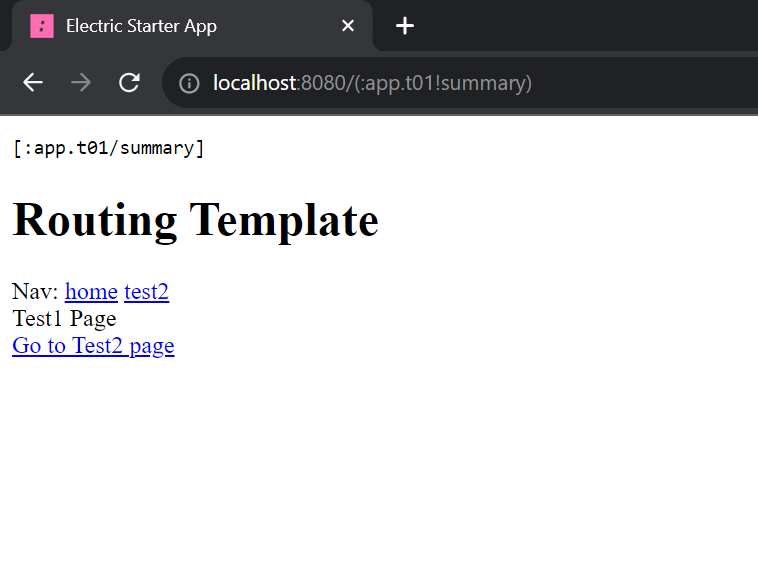
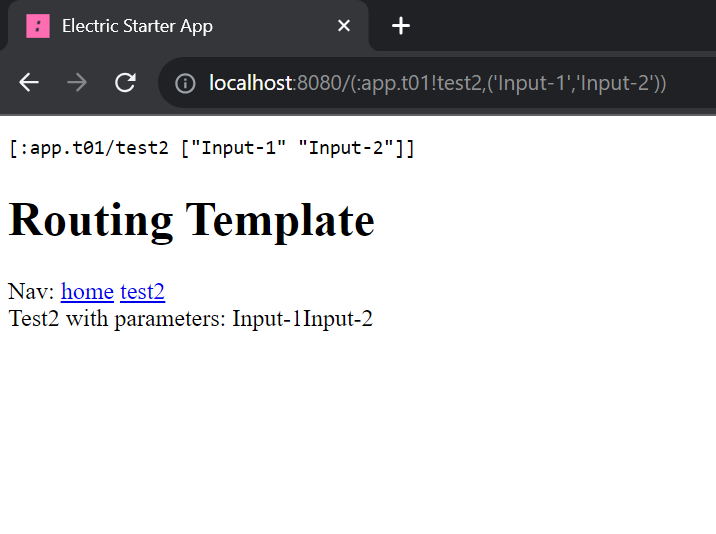

# Routing Template

This template is simplified from [Datomic Browser]("https://github.com/hyperfiddle/electric-datomic-browser/tree/main").

The routing functions are in the [`app/t01.cljc`]("src/app/t01.cljc). `app01` function is the main electric function and it calls the `Page` function which routes the other functions.


When you want to call a function without a parameter, you can create a route like:
```clojure
(history/router 1 (e/server (Test1.)))
```

If you want to call a fuction with any parameters, you can write the router like:
```clojure
(history/router 2 (e/server (Test2. x)))
```

`x` denotes the parameters. If you want to send more than one parameter, you can put the all parameters in a vector and send the vector to the function.

After creating routers, you can simply call function with

```clojure
(history/link [::test2 ["Input-1" "Input-2"]] (dom/text "test2"))
```

## Screen Shots:



